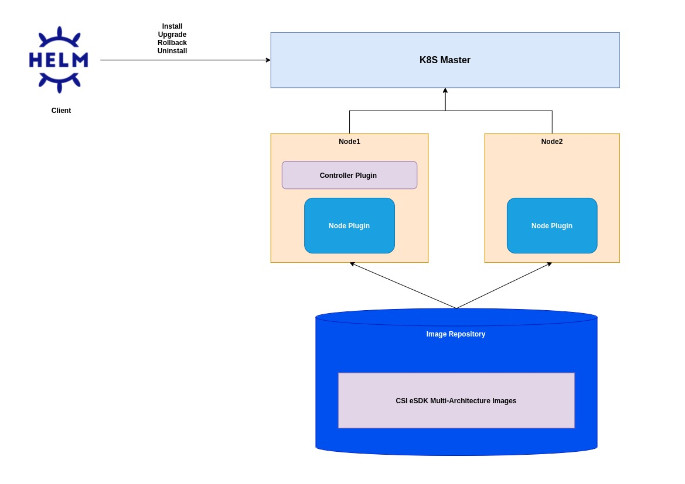
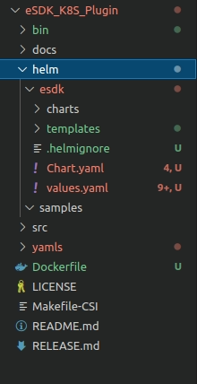
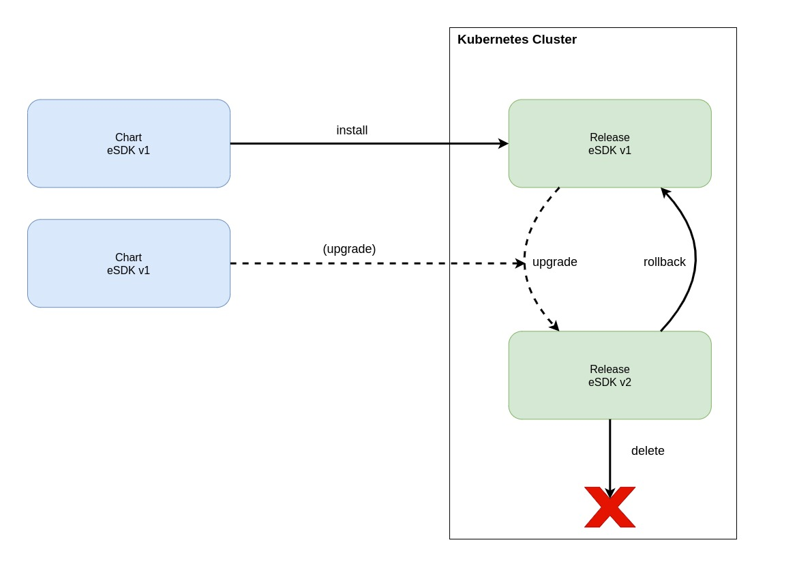

# eSDK Deployment with Helm

  
**Author(s)**: [Amit Roushan](https://github.com/AmitRoushan), [Anvith KS](https://github.com/anvithks), [Basabee Bora](https://github.com/itsbasabee)


## Version Updates
Date  | Version | Description | Author
---|---|---|---
Aug 11th 2021 | 0.1.0 | Initial design draft for Helm deployment for eSDK kubernetes plugin| [Amit Roushan](https://github.com/AmitRoushan) / [Anvith KS](https://github.com/anvithks) / [Basabee Bora](https://github.com/itsbasabee)

## Motivation and background

The current deployment of the eSDK K8S plugin uses multiple yaml files and different configmaps. For every resource that has to be deplpyed the configuration changes have to be made in different locations. 
Helm is a de-facto standard for managing Kubernetes packages and deployments. To adapt to industry standard approaches for deployment, the current method of deployment of eSDK can be translated to one using Helm.

## Goals

- Adapt the existing deployment of eSDK Kubernetes plugin using Helm.  


### Non-Goals

- The individual yaml files and their functions will not be explained.
- This document will not elaborate Helm and how Helm works. The [Helm documentation](https://helm.sh/docs/) takes care of this.

### Assumptions and Constraints

- This document assumes Kubernetes as the orchestrator.
- For the intitial design of the Helm deployment, the current state of the eSDK plugin will be considered.
- Adapting the deployments of new features should be taken care by the feature owners.
- eSDK container images should be made available through image repository (local or remote) or should be available locally on the node.
- Helm3 does not support rollback or upgrade of CRDs.
  
## Requirement Analysis

### Input Requirements

- Support Helm chart deployment for eSDK plugin
  
### Feature Requirements
- Helm3 support
- Translate the existing deployment and adapt to the Helm3 deployment
- Add recommendations of Helm deployment for eSDK.

#### Requirement Analysis

- Host eSDK container images over image repository
    - Only support Huawei image repository (Internal)
    - Images should be made public.  
- Helm/Chart package will be placed in eSDK public repository. Users can clone the same and use for deployments.
- Support for Helm features like:
    - Install
    - Upgrade
    - Rollback 
    - Uninstall
- Support configuration management using Helm
- High availability controller plugin support (leader election)
    - In this release no support for HA of controller plugin.
    - The design for the same will be proposed in a different design document.
- Secret configuration management of backend storage
    - Currently the username and password are sensitive information for storage backend and are visible in plain text.
    - They will be made available to the controller and node plugins using the Secrets resource of Kubernetes.
    - Use Helm for secret create and update
- Based on the Kubernetes version, configure standard sidecars for controller + node plugin. 
    - Make sidecar configurable based on Kubernetes version
    - Allow customer to configure sidecars
- Maintain Helm and Kubernetes version compatibility
- Add example for minimum viable Helm deployment


#### Functional Requirements
- Ensure standard eSDK deployment with Helm
- Version compatibility between eSDK, Kubernetes and Helm.
#### Non Functional Requirements

##### Performance Requirements
- Helm deployment should not take considerable amount of time.

##### Security Requirements
- Keep username and password secure

##### Other Non Functional Requirements (Scalability, HA etc…)
- Image size should not be large.
- Multi-architecture support
- Ensure deployment of single esdk instance in a Kubernetes cluster

## Architecture Analysis

### System Architecture



- Current deployment approach
    - User has to understand and make multiple configuration changes
    - There are no default attributes / values defined
    - The complexity of software lifecycle management wrt upgrade, rollback etc is cumbersome.
    
- This begs to adoption of a more robust, scalable and standard deployment approach.
    - Helm is the industry accepted standard for package deployment and management for Kubernetes.

- Helm will act as a client and will abstract:
    - software lifecycle management
    - configuration management

- Helm will initiate the installation, upgrade and rollback by converting the templates into the respective resource instances and deploy them over K8S cluster.

- Helm will support the uninstallation of the release.

### Architecture Tenets
N/A


### High Level Module Architecture
N/A  

## Detailed Design


### Helm charts location

- The Helm charts will be maintained in the GitHub repo for eSDK.
- The charts and templates with the values will be maintained in the same repository at the same level as `src` as follows:  



- This folder contains samples with some examples of basic deployments


### Configuration Management
Helm uses a packaging format called charts. A chart is a collection of files that describe a related set of Kubernetes resources. Charts are created as files laid out in a particular directory tree. The same directory tree can be archived and used for deployment.

eSDK chart file structure:
```yaml
    esdk_K8S_Plugin/
       helm/
         esdk/
            Charts.yaml                                             # YAML file containing information about the esdk chart
            README.md                                               # README file
            values.yaml                                             # The default configuration values for the chart
            values.schema.json                                      # A JSON Schema for imposing a structure on the values.yaml file
            charts/                                                 # A directory containing crd dependency of esdk.
                snapshot-crds/
                  Chart.yaml
                  crds/                                             # set of esdk custom resource definitions
                    snapshot.storage.k8s.io_volumesnapshotclasses.yaml    
                    snapshot.storage.k8s.io_volumesnapshotcontents.yaml
                    snapshot.storage.k8s.io_volumesnapshots.yaml
            templates/                                              # A directory of templates that, when combined with values,
                                                                    # will generate valid Kubernetes manifest files
              huawei.csi.configmap.yaml
              huawei-csi-controller.yaml
              huawei-csi-node.yaml
              
```

Following section explain about each file and directory in esdk helm.

#### Charts.yaml

```yaml
apiVersion: v2 (The apiVersion field should be v2 for Helm charts that require at least Helm 3)
name: esdk
version: 0.1.0 # A SemVer 2 version
kubeVersion: ">= 1.13.0 < 1.19.3"  # compatible Kubernetes versions, helm installation fails fail if the cluster runs an unsupported Kubernetes version
description: Huawei Container Storage Interface (CSI) Driver
home: https://github.com/Huawei/eSDK_K8S_Plugin
sources:
  - https://github.com/Huawei/eSDK_K8S_Plugin
appVersion: "2.2.13"# The version of the app that this contains (optional). Quotes recommended.
dependencies:
  - name: snapshot-crds
    version: # A SemVer 2 version same as esdk version
    repository: https://github.com/Huawei/eSDK_K8S_Plugin
    condition: snapshot.enabled
    tags:
      - snapshot-crds
```
```version``` and ```appVersion``` fields are specific to esdk helm release
`dependencies` are optional.

#### crds
CRD YAML files of esdk deployment are placed in the `crds/` directory. Helm will attempt to load all of the files in the CRD directory into Kubernetes.
When Helm installs a new chart, it will upload the CRDs, pause until the CRDs are made available by the API server, 
and then start the template engine, render the rest of the chart, and upload it to Kubernetes. 
Because of this ordering, CRD information is available in the `.Capabilities` object in Helm templates, 
and Helm templates may create new instances of objects that were declared in CRDs.

The esdk snapshot CRDs are enabled only for snapshot scenario. Hence CRDs are maintained as dependencies which can be enabled 
for snapshot scenario by setting ```.Values.snapshot.enable``` to true or setting snapshot-crds tags on command line argument
 ```helm install --set tags.snapshot-crds=true ```

There are some [limitation of CRDs with Helm 3](https://helm.sh/docs/topics/charts/#limitations-on-crds) release in reinstall and upgrade scenario
Operators wishes to upgrade or delete CRDs are encouraged to do this manually and with great care

#### values.yaml
The file maintains default values of different configurable attributes in templates files.

```yaml
backends:
  - storage: "oceanstor-san",
    name: "***",
    urls: 
      - "https://1.2.3.4:8088"
      - "https://5.6.7.8:8088"
    pools:
      - StoragePool001
      - StoragePool002
    parameters: 
      protocol: roce
      portals: 
        - 1.2.3.4
        - 5.6.7.8
# Flag to enable or disable resize (Optional)
resizer:
  enable: false
# Flag to enable or disable snapshot (Optional)
snapshot: 
  enable: false

images:
  # The image name and tag for the attacher, provisioner and registrar sidecars. These must match the appropriate Kubernetes version.
  sidecar:
    attacher: quay.io/k8scsi/csi-attacher:v1.2.1
    provisioner: quay.io/k8scsi/csi-provisioner:v1.6.0
    registrar: quay.io/k8scsi/csi-node-driver-registrar:v2.0.1
    resizer: quay.io/k8scsi/csi-resizer:v1.0.1
    snapshotter: quay.io/k8scsi/csi-snapshotter:v3.0.2
    snapshotController: quay.io/k8scsi/snapshot-controller:v3.0.2
  # The image name and tag for the Huawei CSI controller service container. 
  huaweiCsiControllerService: huawei-csi:1.2.3
  # The image name and tag for the Huawei CSI node service container
  huaweiCsiNodeService: huawei-csi:1.2.3
# Default image pull policy for container images
imagePullPolicy: {{ .Values.imagePullPolicy }}
```


#### templates
```templates``` directory maintains all templates files. Helm template engine render all the template files with available 
default values from ```values.yaml``` and ```Charts.yaml``` file or value supplied from command line arguments.

Following are template file available for esdk deployment:

##### huawei-csi-controller.yaml
Following are kubernetes resources maintained in template file for a controller to get deployed:
- Deployment
- ServiceAccount
- ClusterRole
- ClusterRoleBinding

eSDK Controller plugin are deployd with following scenario:
- Simple controller 
- Controller with resizer 
  - The deployment scenario can be enable/disabled with ```Value.resizer.enable```
- Controller with snapshot
  - The deployment scenario can be enabled with ```Value.snapshot.enable```

High availability support of controller plugin will be part of future work.

Sample:
```yaml
---
kind: ServiceAccount
apiVersion: v1
metadata:
  name: huawei-csi-controller
  namespace: kube-system
---
kind: ClusterRole
apiVersion: rbac.authorization.k8s.io/v1
metadata:
  name: huawei-csi-provisioner-runner
rules:
  - apiGroups: [""]
    resources: ["persistentvolumes"]
    verbs: ["get", "list", "watch", "create", "delete", "patch"]
  - apiGroups: [""]
    resources: ["persistentvolumeclaims"]
    verbs: ["get", "list", "watch", "update", "patch"]
  - apiGroups: ["storage.k8s.io"]
    resources: ["storageclasses"]
    verbs: ["get", "list", "watch"]
  - apiGroups: [""]
    resources: ["events"]
    verbs: ["list", "watch", "create", "update", "patch"]
  - apiGroups: ["snapshot.storage.k8s.io"]
    resources: ["volumesnapshots"]
    verbs: ["list", "watch", "create", "update", "patch"]
  - apiGroups: ["snapshot.storage.k8s.io"]
    resources: ["volumesnapshotcontents"]
    verbs: ["get", "list", "watch", "create", "delete", "patch"]
  - apiGroups: ["snapshot.storage.k8s.io"]
    resources: ["volumesnapshots/status"]
    verbs: ["update"]
  - apiGroups: ["storage.k8s.io"]
    resources: ["csinodes"]
    verbs: ["get", "list", "watch"]
  - apiGroups: [""]
    resources: ["nodes"]
    verbs: ["get", "list", "watch"]
    
{{ if .Values.resizer.enable }}    
---
kind: ClusterRole
apiVersion: rbac.authorization.k8s.io/v1
metadata:
  name: huawei-csi-resizer-runner
rules:
  - apiGroups: [""]
    resources: ["persistentvolumes"]
    verbs: ["get", "list", "watch", "update", "patch"]
  - apiGroups: [""]
    resources: ["persistentvolumeclaims"]
    verbs: ["get", "list", "watch"]
  - apiGroups: [""]
    resources: ["persistentvolumeclaims/status"]
    verbs: ["update", "patch"]
  - apiGroups: [""]
    resources: ["pods"]
    verbs: ["get", "list", "watch"]
  - apiGroups: [""]
    resources: ["events"]
    verbs: ["list", "watch", "create", "update", "patch"]

---
kind: ClusterRoleBinding
apiVersion: rbac.authorization.k8s.io/v1
metadata:
  name: huawei-csi-resizer-role
subjects:
  - kind: ServiceAccount
    name: huawei-csi-controller
    namespace: kube-system
roleRef:
  kind: ClusterRole
  name: huawei-csi-resizer-runner
  apiGroup: rbac.authorization.k8s.io


---
kind: Role
apiVersion: rbac.authorization.k8s.io/v1
metadata:
  namespace: kube-system
  name: huawei-csi-resizer-cfg
rules:
  - apiGroups: ["coordination.k8s.io"]
    resources: ["leases"]
    verbs: ["get", "watch", "list", "delete", "update", "create"]

---
kind: RoleBinding
apiVersion: rbac.authorization.k8s.io/v1
metadata:
  name: huawei-csi-resizer-role-cfg
  namespace: kube-system
subjects:
  - kind: ServiceAccount
    name: huawei-csi-controller
    namespace: kube-system
roleRef:
  kind: Role
  name: huawei-csi-resizer-cfg
  apiGroup: rbac.authorization.k8s.io

---
kind: ClusterRoleBinding
apiVersion: rbac.authorization.k8s.io/v1
metadata:
  name: huawei-csi-provisioner-role
subjects:
  - kind: ServiceAccount
    name: huawei-csi-controller
    namespace: kube-system
roleRef:
  kind: ClusterRole
  name: huawei-csi-provisioner-runner
  apiGroup: rbac.authorization.k8s.io
{{ end }}
{{ if .Values.snapshot.enable }}    
---
kind: ClusterRole
apiVersion: rbac.authorization.k8s.io/v1
metadata:
  name: huawei-csi-snapshotter-runner
rules:
  - apiGroups: [""]
    resources: ["events"]
    verbs: ["list", "watch", "create", "update", "patch"]
  - apiGroups: ["snapshot.storage.k8s.io"]
    resources: ["volumesnapshotclasses"]
    verbs: ["get", "list", "watch"]
  - apiGroups: ["snapshot.storage.k8s.io"]
    resources: ["volumesnapshotcontents"]
    verbs: ["create", "get", "list", "watch", "update", "delete"]
  - apiGroups: ["snapshot.storage.k8s.io"]
    resources: ["volumesnapshotcontents/status"]
    verbs: ["update"]

---
kind: ClusterRoleBinding
apiVersion: rbac.authorization.k8s.io/v1
metadata:
  name: huawei-csi-snapshotter-role
subjects:
  - kind: ServiceAccount
    name: huawei-csi-controller
    namespace: kube-system
roleRef:
  kind: ClusterRole
  name: huawei-csi-snapshotter-runner
  apiGroup: rbac.authorization.k8s.io

---
kind: Role
apiVersion: rbac.authorization.k8s.io/v1
metadata:
  namespace: kube-system
  name: huawei-csi-snapshotter-leaderelection
rules:
  - apiGroups: ["coordination.k8s.io"]
    resources: ["leases"]
    verbs: ["get", "watch", "list", "delete", "update", "create"]

---
kind: RoleBinding
apiVersion: rbac.authorization.k8s.io/v1
metadata:
  name: huawei-csi-snapshotter-leaderelection
  namespace: kube-system
subjects:
  - kind: ServiceAccount
    name: huawei-csi-controller
    namespace: kube-system
roleRef:
  kind: Role
  name: huawei-csi-snapshotter-leaderelection
  apiGroup: rbac.authorization.k8s.io

---
kind: ClusterRole
apiVersion: rbac.authorization.k8s.io/v1
metadata:
  name: snapshot-controller-runner
rules:
  - apiGroups: [""]
    resources: ["persistentvolumes"]
    verbs: ["get", "list", "watch"]
  - apiGroups: [""]
    resources: ["persistentvolumeclaims"]
    verbs: ["get", "list", "watch", "update"]
  - apiGroups: ["storage.k8s.io"]
    resources: ["storageclasses"]
    verbs: ["get", "list", "watch"]
  - apiGroups: [""]
    resources: ["events"]
    verbs: ["list", "watch", "create", "update", "patch"]
  - apiGroups: ["snapshot.storage.k8s.io"]
    resources: ["volumesnapshotclasses"]
    verbs: ["get", "list", "watch"]
  - apiGroups: ["snapshot.storage.k8s.io"]
    resources: ["volumesnapshotcontents"]
    verbs: ["create", "get", "list", "watch", "update", "delete"]
  - apiGroups: ["snapshot.storage.k8s.io"]
    resources: ["volumesnapshots"]
    verbs: ["get", "list", "watch", "update"]
  - apiGroups: ["snapshot.storage.k8s.io"]
    resources: ["volumesnapshots/status"]
    verbs: ["update"]

---
kind: ClusterRoleBinding
apiVersion: rbac.authorization.k8s.io/v1
metadata:
  name: snapshot-controller-role
subjects:
  - kind: ServiceAccount
    name: huawei-csi-controller
    namespace: kube-system
roleRef:
  kind: ClusterRole
  name: snapshot-controller-runner
  apiGroup: rbac.authorization.k8s.io

---
kind: Role
apiVersion: rbac.authorization.k8s.io/v1
metadata:
  namespace: kube-system
  name: snapshot-controller-leaderelection
rules:
  - apiGroups: ["coordination.k8s.io"]
    resources: ["leases"]
    verbs: ["get", "watch", "list", "delete", "update", "create"]

---
kind: RoleBinding
apiVersion: rbac.authorization.k8s.io/v1
metadata:
  name: snapshot-controller-leaderelection
  namespace: kube-system
subjects:
  - kind: ServiceAccount
    name: huawei-csi-controller
    namespace: kube-system
roleRef:
  kind: Role
  name: snapshot-controller-leaderelection
  apiGroup: rbac.authorization.k8s.io
{{ end }}
---
kind: Deployment
apiVersion: apps/v1
metadata:
  name: huawei-csi-controller
  namespace: kube-system
spec:
  replicas: 1
  selector:
    matchLabels:
      app: huawei-csi-controller
  template:
    metadata:
      labels:
        app: huawei-csi-controller
    spec:
      serviceAccount: huawei-csi-controller
      hostNetwork: true
      containers:
        - name: csi-provisioner
          image: {{ .Values.images.sidecar.provisioner }}
          args:
            - "--csi-address=$(ADDRESS)"
            - "--timeout=6h"
          env:
            - name: ADDRESS
              value: /var/lib/csi/sockets/pluginproxy/csi.sock
          imagePullPolicy: {{ .Values.imagePullPolicy }}
          volumeMounts:
            - name: socket-dir
              mountPath: /var/lib/csi/sockets/pluginproxy/

        - name: csi-attacher
          image: {{ .Values.images.sidecar.attacher }}
          args:
            - "--csi-address=$(ADDRESS)"
          env:
            - name: ADDRESS
              value: /var/lib/csi/sockets/pluginproxy/csi.sock
          imagePullPolicy: {{ .Values.imagePullPolicy }}
          volumeMounts:
            - name: socket-dir
              mountPath: /var/lib/csi/sockets/pluginproxy/
        {{ if .Values.resizer.enable }}    
        - name: csi-resizer
          image: {{ .Values.images.sidecar.resizer }} 
          args:
            - "--csi-address=$(ADDRESS)"
          env:
            - name: ADDRESS
              value: /var/lib/csi/sockets/pluginproxy/csi.sock
          imagePullPolicy: {{ .Values.imagePullPolicy }}
          volumeMounts:
            - name: socket-dir
              mountPath: /var/lib/csi/sockets/pluginproxy/
         {{ end }}
        {{ if .Values.snapshot.enable }}    
        - name: csi-snapshotter
          image: {{ .Values.images.sidecar.snapshotter }}
          args:
            - "--v=5"
            - "--csi-address=$(ADDRESS)"
          env:
            - name: ADDRESS
              value: /var/lib/csi/sockets/pluginproxy/csi.sock
          imagePullPolicy: {{ .Values.imagePullPolicy }}
          volumeMounts:
            - mountPath: /var/lib/csi/sockets/pluginproxy/
              name: socket-dir
       
        - name: snapshot-controller
          image: {{ .Values.images.sidecar.snapshotController }}
          args:
            - "--v=5"
            - "--leader-election=false"
          imagePullPolicy: {{ .Values.imagePullPolicy }}
          volumeMounts:
            - mountPath: /var/lib/csi/sockets/pluginproxy/
              name: socket-dir
        {{ end ]}
        - name: huawei-csi-driver
          image: {{ required "Must provide the CSI controller service container image." .Values.images.huaweiCsiControllerService }}
          args:
            - "--endpoint=$(CSI_ENDPOINT)"
            - "--controller"
            - "--containerized"
            - "--backend-update-interval=120"
            - "--driver-name=csi.huawei.com"
          env:
            - name: CSI_ENDPOINT
              value: /var/lib/csi/sockets/pluginproxy/csi.sock
          imagePullPolicy: {{ .Values.imagePullPolicy }}
          volumeMounts:
            - name: socket-dir
              mountPath: /var/lib/csi/sockets/pluginproxy/
            - name: log
              mountPath: /var/log
            - name: config-map
              mountPath: /etc/huawei
            - name: secret
              mountPath: /etc/huawei/secret
      volumes:
        - name: socket-dir
          emptyDir:
        - name: log
          hostPath:
            path: /var/log/
            type: Directory
        - name: config-map
          configMap:
            name: huawei-csi-configmap
        - name: secret
          secret:
            secretName: huawei-csi-secret
```
##### huawei-csi-node.yaml
Following are kubernetes resources maintained in template file for a node serviced to get deployed:
- Daemonset
- ServiceAccount
- ClusterRole
- ClusterRoleBinding

Sample:
```yaml
---
apiVersion: v1
kind: ServiceAccount
metadata:
  name: huawei-csi-node
  namespace: kube-system

---
kind: ClusterRole
apiVersion: rbac.authorization.k8s.io/v1
metadata:
  name: huawei-csi-driver-registrar-runner
  namespace: kube-system
rules:
  - apiGroups: [""]
    resources: ["events"]
    verbs: ["get", "list", "watch", "create", "update", "patch"]

---
kind: ClusterRoleBinding
apiVersion: rbac.authorization.k8s.io/v1
metadata:
  name: huawei-csi-driver-registrar-role
subjects:
  - kind: ServiceAccount
    name: huawei-csi-node
    namespace: kube-system
roleRef:
  kind: ClusterRole
  name: huawei-csi-driver-registrar-runner
  apiGroup: rbac.authorization.k8s.io
---
kind: DaemonSet
apiVersion: apps/v1
metadata:
  name: huawei-csi-node
  namespace: kube-system
spec:
  selector:
    matchLabels:
      app: huawei-csi-node
  template:
    metadata:
      labels:
        app: huawei-csi-node
    spec:
      serviceAccountName: huawei-csi-node
      hostPID: true
      hostNetwork: true
      containers:
        - name: csi-node-driver-registrar
          image: {{ .Values.images.sidecar.registrar }}
          args:
            - "--csi-address=/csi/csi.sock"
            - "--kubelet-registration-path=/var/lib/kubelet/plugins/csi.huawei.com/csi.sock"
          imagePullPolicy: {{ .Values.imagePullPolicy }}
          volumeMounts:
            - name: plugin-dir
              mountPath: /csi
            - name: registration-dir
              mountPath: /registration

        - name: huawei-csi-driver
          image: {{ required "Must provide the CSI Node service image." .Values.images.huaweiCsiNodeService }}
          args:
            - "--endpoint=/csi/csi.sock"
            - "--containerized"
            - "--driver-name=csi.huawei.com"
            - "--volume-use-multipath=true"
          securityContext:
            privileged: true
            capabilities:
              add: ["SYS_ADMIN"]
            allowPrivilegeEscalation: true
          imagePullPolicy: {{ .Values.imagePullPolicy }}
          lifecycle:
            preStop:
              exec:
                command: ["/bin/sh", "-c", "rm -f /csi/csi.sock"]
          volumeMounts:
            - name: plugin-dir
              mountPath: /csi
            - name: pods-dir
              mountPath: /var/lib/kubelet
              mountPropagation: "Bidirectional"
            - name: etc-dir
              mountPath: /etc
            - name: log-dir
              mountPath: /var/log
            - name: dev-dir
              mountPath: /dev
              mountPropagation: "HostToContainer"
            - name: iscsi-dir
              mountPath: /var/lib/iscsi
            - name: config-map
              mountPath: /etc/huawei
            - name: secret
              mountPath: /etc/huawei/secret
      volumes:
        - name: plugin-dir
          hostPath:
            path: /var/lib/kubelet/plugins/csi.huawei.com
            type: DirectoryOrCreate
        - name: registration-dir
          hostPath:
            path: /var/lib/kubelet/plugins_registry
            type: Directory
        - name: pods-dir
          hostPath:
            path: /var/lib/kubelet
            type: Directory
        - name: etc-dir
          hostPath:
            path: /etc
            type: Directory
        - name: dev-dir
          hostPath:
            path: /dev
            type: Directory
        - name: iscsi-dir
          hostPath:
            path: /var/lib/iscsi
        - name: log-dir
          hostPath:
            path: /var/log/
            type: Directory
        - name: config-map
          configMap:
            name: huawei-csi-configmap
        - name: secret
          secret:
            secretName: huawei-csi-secret

```

##### huawei.csi.configmap.yaml
```yaml
kind: ConfigMap
apiVersion: v1
metadata:
  name: huawei-csi-configmap
  namespace: kube-system
data:
  csi.json: |
    {{ $length := len .Values.backends }} {{ if gt $length 0 }} { {{ end }}
      "backends": {{ .Values.backends | toPrettyJson | nindent 8 }} 
    {{ $length := len .Values.backends }} {{ if gt $length 0 }} } {{ end }}
```

#### Handling sensitive information
All sensitive information are passed to kubernetes as secret resource. But to ensure e2e sensitive information handling, 
information are first encrypted and then passed on to secret object.
eSDK CSI plugin ensure it by providing cli tool to receive sensitive information from user and create K8S Secret object.

With helm support [Chart plugin](https://helm.sh/docs/topics/plugins/) to add custom command to run custom tool with helm.


### Deployment Management
An application in Kubernetes typically consists of at least two resource types: a deployment resource, which describes a set of pods to be deployed together, and a services resource, which defines endpoints for accessing the APIs in those pods. The application can also include ConfigMaps, Secrets, and Ingress.

A Repository is the place where charts can be collected and shared.  
A Release is an instance of a chart running in a Kubernetes cluster. One chart can often be installed many times into the same cluster. And each time it is installed, a new release is created. Consider a MySQL chart. If you want two databases running in your cluster, you can install that chart twice. Each one will have its own release, which will in turn have its own release name.  

For any deployment, you need several Kubernetes commands (kubectl) to create and configure resources. Instead of manually creating each resource separately, you can create many resources with one command. A Helm chart defines several Kubernetes resources as a set. A default chart has a minimum of a deployment template and a service template.  

Helm installs charts into Kubernetes, creating a new release for each installation. And to find new charts, you can search Helm chart repositories.  

Please note:   
**We are considering only esdk deployment using Helm charts placed in the esdk GitHub repository.**

Helm can make deployments easier and repeatable because all resources for an application are deployed by running one command:  

``` 
$ helm install <chart>
```
With Helm, configuration settings are kept separate from the manifest formats. You can edit the configuration values without changing the rest of the manifest. Configuration settings are in a values.yaml file. You update the runtime parameters in that file to deploy each application instance differently.

You can use single commands for installing, upgrading, and deleting releases.




The default values for a deployment are stored in the values.yaml file in the chart. You can customize aspects of the deployment by overriding those values.

First, the Helm CLI uses the Kubernetes CLI's configuration to connect to your current cluster.

After it connects to your cluster, you use Helm installation commands to specify the attributes of the release.

- To specify a release's name, use the --name flag:

    `$ helm install --name sample-esdk helm/esdk`

- To deploy the release into a Kubernetes namespace, use the --namespace flag:

    `$ helm install --namespace kube-system helm/esdk`

- To override a value, use the --set flag:

    `$ helm install --set snapshot.enable=true helm/esdk`

- To override values with a values file, use the --values or the --f flag:

    `$ helm install --values custom-values.yaml helm/esdk`

- Get the details about a release:  
    `$ helm get sample-esdk`  

- Upgrade a release:  
This command upgrades a release to a new version of a chart. The upgrade arguments must be a release and chart. 

If the deployed Chart version is v0.1.0 and the deployed application version is 2.2.3.


```yaml
apiVersion: v2 (The apiVersion field should be v2 for Helm charts that require at least Helm 3)
name: esdk
version:  0.1.0
appVersion: 2.2.3
...

```
In order to upgrade our Chart, we will make an adaptation to our values.yaml. We will change the `snapshot enable` value to `true`.

```yaml
... 

resizer:
  enable: false
snapshot: 
  enable: true

...
```
To override values in a chart, use either the '--values' flag and pass in a file or use the '--set' flag and pass configuration from the command line, to force string values, use '--set-string'. In case a value is large use '--set-file' to read the single large value from file.

  ```
  helm upgrade --set snapshot.enable=true sample-esdk 
  ```
You can specify the '--values'/'-f' flag multiple times. The priority will be given to the last (right-most) file specified. For example, if both myvalues.yaml and override.yaml contained a key called 'Test', the value set in override.yaml would take precedence:  

    `$ helm upgrade -f myvalues.yaml -f override.yaml sample-esdk`  


- Roll back a release:  
    `$ helm rollback sample-esdk <revision>`  

- Delete a release:  
    `$ helm delete sample-esdk`  


### Use case View


#### List of Typical Usecases


 

### Development and Deployment Context

#### Code
NA
#### Debug Model
NA

  
#### Build & Package
NA

  #### Deployment

//How to install and deploy the module in the system, hardware resource requirements etc. Any other network or such requirements..like client or http server needed etc…

  
### Execution View

//During the run time, any specific aspects to be considered...like logging to be done for the module etc..It is not functional logs, it is specific to the module maintenance; OR Runtime replication or any such requirements to be considered during the design

  
## Sequence Diagrams

//Provide the key control and data flow sequence diagrams here

  
## Design Alternatives and other notes

//If you have any other ideas or alternate suggestions or notes which needs further analysis or later consideration, please add here
  

## Open Issues

//All the open issues go here. Please track it else where to closure

  
## Design Requirements / Tasks

//List of detailed tasks for this module go here. Based on all the design and analysis, please list all the tasks to be completed for the implementation and release of the module. If you are updating the overall task list or location, please provide the links or ids here...This is to get an overall consolidation of task items for this module

## Scratchpad

//All raw inputs or discussion points or etc can be added here
https://github.com/jsafrane/community/blob/master/contributors/design-proposals/storage/container-storage-interface.md#recommended-mechanism-for-deploying-csi-drivers-on-kubernetes


#### K8S Secrets
https://kubernetes.io/docs/concepts/configuration/secret/

#### Helm architecture
https://helm.sh/docs/topics/architecture/

#### Helm Chart hooks
https://rafay.co/the-kubernetes-current/helm-chart-hooks-tutorial/


---
## Default Values
---

### **kind:** *ConfigMap*
 
|Namespace|storage|name|urls|pools|parameters|  
|---|---|---|---|---|---|
| `kube-system` | `fusionstorage-san` | `***` | `["https://*.*.*.*:28443"]` | `["***", "***"]` | `{"protocol": "iscsi", "portals": ["*.*.*.*", "*.*.*.*"]}`|
| `kube-system` | `fusionstorage-nas` | `***` | `["https://*.*.*.*:28443"]` | `["***", "***"]` | `{"protocol": "nfs", "portals": ["*.*.*.*"]}`|
| `kube-system` | `fusionstorage-san` | `***` | `["https://*.*.*.*:28443"]` | `["***", "***"]` | `{"protocol": "scsi", "portals": [{"***": "*.*.*.*", "***": "*.*.*.*"}]}`|
| `kube-system` | `oceanstor-san` | `***` | `["https://*.*.*.*:8088", "https://*.*.*.*:8088"]` | `["***", "***"]` | `{"protocol": "scsi", "portals": [{"***": "*.*.*.*", "***": "*.*.*.*"}]}`|
| `kube-system` | `oceanstor-san` | `***` | `["https://*.*.*.*:8088", "https://*.*.*.*:8088"]` | `["***", "***"]` | `{"protocol": "iscsi", "portals": ["*.*.*.*", "*.*.*.*"]}`|
| `kube-system` | `oceanstor-nas` | `***` | `["https://*.*.*.*:8088", "https://*.*.*.*:8088"]` | `["***", "***"]` | `{"protocol": "nfs", "portals": ["*.*.*.*"]}`|
| `kube-system` | `oceanstor-san` | `***` | `["https://*.*.*.*:8088", "https://*.*.*.*:8088"]` | `["***", "***"]` | `{"protocol": "roce", "portals": ["*.*.*.*", "*.*.*.*"]}`|

### **kind:** *Deployment*

### **kind:** *Pods*


#### Install / Upgrade / Rollback / delete
No upgrade strategy in the current Kubernetes.
recommeded strategies to be added to Node plugin and other resources.
