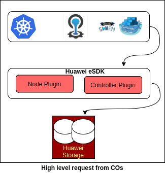
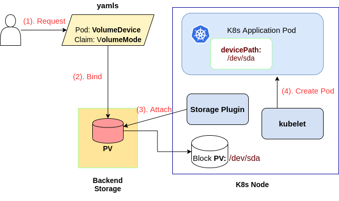
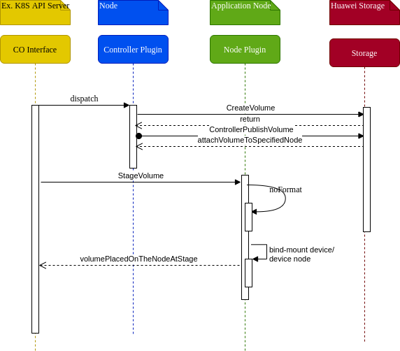

# Raw Block Volume

## Goals

Add support of Raw Block Volume Capabilities in eSDK_Plugin, which allows persistent volumes to be exposed inside containers as a block device instead of as a mounted file system.

## Motivation and background

* Support of raw block volume feature, enable users to choose appropirate type of volume(filesystem mounted volume vs raw block volume) for thier applications.  

* There are few high performance applications or SDS softwares which need direct access to the block device because the file system layer introduces unnecessary overhead. The example of such type applications are databases (MySQL, MongoDB, Cassandra etc.). They require consistent I/O performance and low latency to read/write data directly from disk. The abaility to provision such type of raw block volume definitly support these applications for thier high-performance usecases.

* At production system, raw block volume is essential functionality. In addition, kuberenets 1.18 version(stable) support raw block volume feature.Thus,Huawei_eSDK_Plugin should also support.


### Non-Goals


## Requirement Analysis  

### Input Requirements  

Huawei Container Storage Interface (CSI) Driver is used to provision LUN, recycle LUN, and provide a series of disaster recovery functions of storages for Kubernetes Containers. Currently it supports *volumeMode* as *FileSystem*. As CSI also supports [*raw block volume*](https://kubernetes-csi.github.io/docs/raw-block.html), eSDK/Huawei CSI plugin also need to support *raw block volume* so that the storgae provisioned to the *pods* can use them as direct block devices.


### Feature Requirements

Below is the list of requirements:

* Support to create a raw block volume when user create a PVC or Pod
* Support to delete a raw block volume when user delete a PVC or Pod
* Support to create a snapshot from an existing raw block volume
* Support to delete a snapshot(of raw block volume)
* Support to create a raw block volume from an existing snapshot
* Support to clone a raw block volume from another raw block volume
* Support to expand a raw block volume


### Requirement Analysis

CSI spec does not support the capability query for block devices so the users need to understand the <mark>VolumeCapabilites</mark>.
Huawei CSI Driver should honor the request for <mark>RawBlockVolume</mark> request so that the application can use them as direct block device

#### List of Requirements:

##### Functional Requirements:

* eSDK_Plugin should support "volumeMode=Block" in PersistentVolumeClaimSpec and create PVC.

* eSDK_Plugin should support "devicePath: < path >" in PodSpec and create Pod.

- ControllerPlugin should make a call to <mark>CreateVolume</mark> to the Huawei Backend Storage
  - The volumes can be created new, from an existing snapshot or can be cloned from an existing volume
- ControllerPlugin should make a call <mark>PublishVolume</mark> to the Huawei Backend storage to attach the created volume to the specified node
- ControllerPlugin should make a call to <mark>DeleteVolume</mark> to the Huawei Backend Storage
- ControllerPlugin should make a call <mark>UnPublishVolume</mark> to the Huawei Backend storage to detach the volume from the specified node
- NodePlugin should be able to <mark>StageVolume</mark> to temporarily mount the volume (un-formatted) to a staging path (*global directory*) on the node. The
- NodePlugin should be able to <mark>UnStageVolume</mark> to unmount the volume from the staging path (*global directory*) on the node
- NodePlugin should be able to <mark>UnPublishVolume</mark> to unmount the volume from the *application* (target path)
- ControllerPlugin should implement Create/Delete Snapshot as well as Expand Volume (ONLINE)


##### Non Functional Requirements:

- All the Raw Block Device operations should be idempotent
- Proper error handling and parameter validation, such as requested raw block volume from snapshot size etc. should be properly validated
- All other features (like topology, protocol support etc.) should work seamlessly with the Raw Block Volume too


## Architecture Analysis

### System Architecture


Huawei eSDK fulfills the request coming from the Container Orchestrators to provision/de-provision the volumes as well as attach/detach from the nodes and applications.

*Controller Plugin*: It is the single instance gRPC server running on any node and can co-exist with *NodePlugin*

*Node Plugin*: gRPC server running on the Node to which the volume will be provisioned. It can be multi-node installation


### Architecture Tenets

https://github.com/container-storage-interface/spec/blob/master/spec.md


### High Level Module Architecture
Below diagram shows, end to end flow of raw block volume support



## Detailed Design

1. User requests a Pod with volumeDevices, and PVC with volumeMode = Block
2. PV-Binder binds requested PVC and pre-provisioned PV with volumeMode = Block
3. Storage plugin attaches the PV to kubelet node. PV is recognized as /dev/sda on node. Plugin doesn't create filesystem
4. Kubelet starts an application Pod. During Pod creation, the block PV is passed to the Pod as /dev/sda (or any user defined devicePath)

#### List of Typical Usecases:

-  High performance applications like mongoDB, Oracle ASM etc.., require raw block device to be mapped to the Node by COs. These devices will be served with the filesystem on it.
-  Raw Block devices serve for consitent I/O performance, direct I/O and low latency for the applications
-  Storage request from the applications of the COs can come either for Raw Block Volume or a mounted filesystem, based upon the applications
-  Expose a block volume to be used by server admin for administrative functions such as Bootstrapping
- Avoid the overhead of Filesystems on the devices and use as-it-is
- Request of application to bound a PV as Block device only


#### Usecase context model:

Huawei eSDK will serve as the SP for fulfilling the request based upon the call as per the context of driver registration. The storage being served from the Huawei Storage such as Oceanstor or Fusionstorage

#### Interface Model:

There are three different interfaces:
- Identity service
- Controller service
- Node service
  (all three interfaces serves as gRPC server running on same/different nodes)

**Identity service interface**: This need to be implemented by both *node* and *controller* plugins.
 rpc interfaces: *GetPluginInfo*, *GetPluginCapabilities*

**Controller service interface**: It is responsible for volume management.
rpc interfaces: *CreateVolume*, *DeleteVolume*, *ControllerPublishVolume*, *ControllerUnpublishVolume*

**Node service interface**: It is responsible for volume presentation to the target node and the requesting application.
rpc intefaces: *NodeStageVolume*, *NodeUnstageVolume*, *NodePublishVolume*, *NodeUnpublishVolume*
While staging the volume on the node, need to just bind-mount the device or create a device node (using symlink/mknod)

Basically, Following RPC calls for Controller Plugin and Node Plugin need to be validated:
- CreateVolume (Check multiple capabilites for Block device access)
- ControllerPublishVolume
- NodeStageVolume (Create Stage Target path on the node)
- NodePublishVolume (Create symlink/mknod for publishing the volume as raw device to the Poc)

#### External Interfaces:

[**In Context of K8S as the CO]
- COs should make a PVC/PV request for <mark>volumeMode</mark> as *Block*
-  The *external provisioner* and *external attacher* sidecars will take care of listening to the api server request and connect to the Huawei eSDK plugin over gRPC
- Pod request for <mark>volumeDevices</mark> will be served by kubelet which will connect to the Huawei eSDK plugin over gRPC


#### End User Context:

From the End user perspective, usage of this module remains the same as for mounted filesystem support.
Only differentiating aspect is the request for the volumeMode and the way device is accessed i.e. volumeDevices


### Functional Context

TBD

 ### Non Functional Context
TBD

 #### Performance

TBD

#### Security

- Plugin as a overall feature should take care of secure access of the Domain Socket using secure tooling or OS specific features
- Access information for the backend storage should be secured using native CO secure tool or any other secure modules
- Access Modes for the request Raw Block Volume should be properly honored
- The developed code and feature should adhere to any security and vulnerability checks and best practise guidelines


#### Other Non Functional Aspects
NA

### Data View

#### Data and Control Data Contexts

NA

#### Data Model

NA

### Development and Deployment Context

#### Code:
* To request a raw block PersistentVolumeClaim, volumeMode =  "Block" must be specified in the PersistentVolumeClaimSpec.

  #### block-pvc.yaml
  ```
    apiVersion: v1
    kind: PersistentVolumeClaim
    metadata:
      name: block-pvc
    spec:
      accessModes:
        - ReadWriteOnce
      volumeMode: Block
      resources:
        requests:
          storage: 10Gi
  ```

* Once the PVC created, it can be used in a pod definition. Here,  devicePath must be specified for the block device rather than the mount path for the file system.

 #### block-pod.yaml

  ```
  apiVersion: v1
  kind: Pod
  metadata:
    name: pod-with-block-volume
  spec:
    containers:
      - name: raw-vol-container
        image: *
        command: [""]
        args: [ "" ]
        volumeDevices:  
          - name: data
            devicePath: /dev/xvda
    volumes:
      - name: data
        persistentVolumeClaim:
          claimName: block-pvc
  ```

* Below is code snippet, where code modification required

  ```
  func (d *Driver) NodeStageVolume(ctx context.Context, req *csi.NodeStageVolumeRequest) (*csi.NodeStageVolumeResponse, error) {
  	volumeId := req.GetVolumeId()
    ..
    ..
    ..
  	mnt := req.GetVolumeCapability().GetMount()
    device := req.GetVolumeCapability().GetBlock()

    ..
    ..
    ..
      if nil != device {
        parameters := map[string]interface{}{
  		  "targetPath": req.GetStagingTargetPath(),
  		  "device":     //Device for the Block volume,

  	  }
    err := backend.Plugin.StageVolume(volName, parameters)
  }

  func (p *OceanstorSanPlugin) StageVolume(name string, parameters map[string]interface{}) error {
    ..
    ..
    ..
    if AccessType == 'Block' {}
      mknod() //device and targetpath from *parameters*
  }

  ```

#### Debug Model

Check /var/log/Huawei


#### Build & Package

There is no specific changes in context of Raw Block Device request

  #### Deployment

Refer to the deployment doc for the Huawei SDK


### Execution View

Log appropirate version of the plugin and CO versions (if any). Also, the Storage backend serving the request should be properly logged in-context, for debugging and maintainability


## Sequence Diagrams
Sequence diagram for Create Raw Block Volume




## Design Alternatives and other notes

1) If there is a pre-existing volume which is already formatted (using mkfs etc.) then for those volumes any request to provision it as RBD, should be denied with proper error message. This is to maintain consistency

## Open Issues

NA

## Design Requirements / Tasks

//List of detailed tasks for this module go here. Based on all the design and analysis, please list all the tasks to be completed for the implementation and release of the module. If you are updating the overall task list or location, please provide the links or ids here...This is to get an overall consolidation of task items for this module

## Scratchpad

//All raw inputs or discussion points or etc can be added here
